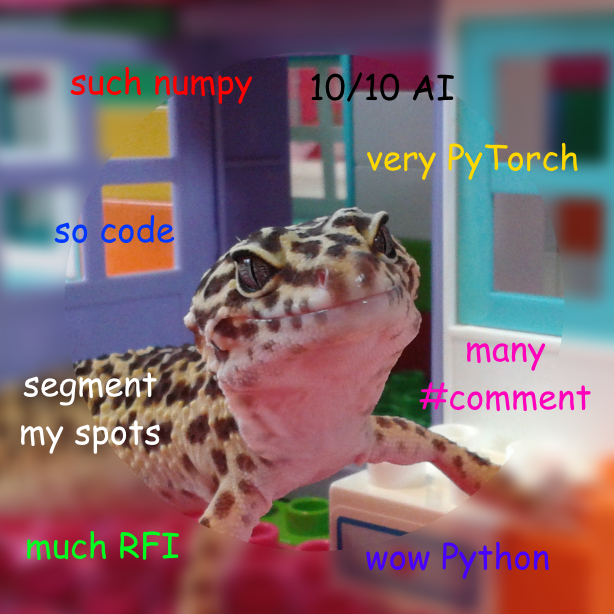

# LeopardGecko
This package contains routines to process and analyse data obtained from predicted segmentation of microscopy data in package.
See  [UnetSegmentation](https://github.com/rosalindfranklininstitute/UnetSegmentation).

## leopardgecko.py
Used to get metrics from the predicted data

### Class Predicted data
Constructor (filename): initialise with a hdf5 containing the volume data that has been predicted and combined from several different orientations. This file is normally the output from the prediction produced by binary unet segmentation https://github.com/rosalindfranklininstitute/UnetSegmentation

Normally, after setting the data file, user has to choose the weighting method used for calculating consistency score.

### AvgPool3D_LargeData()
Uses pytrorch to do a 3D average pooling, by providing parameters *data3d* (data volume),
*w_width* ( width in pixels of the cube chunk that is calculated in the GPU),
*k_width* (does the average in the cube with this width),
*s_stride* (step, in pixels for next average calculation).

This operation is normally done with the weighted predicted data to determine regions with higher consistency.

### Score data
Class to store and analyse score data. Contains routines to generate histograms and suggest volumes of interest based in histogram positions.

## lg-genpredcsreport.py
Utility that can be used to generate a report of consistency score analysis from a combined prediction file. This script usedslg-genpredreport.ipynb notebook. Information about how to use and parameters to use can be obtained by running
' python lg-genpredcsreport.ipynb --help '

## (old) AvgPooling3DConsistencyData.ipynb
An average pooling operation using PyTorch CUDA routines are used. The data obtained gives a score about how consistent the data is in the each of smaller volumes.

## (old) AnalyseAvgPoolResults.ipynb
Data from the average pooling is analysed and consistency score based visualisations are available

